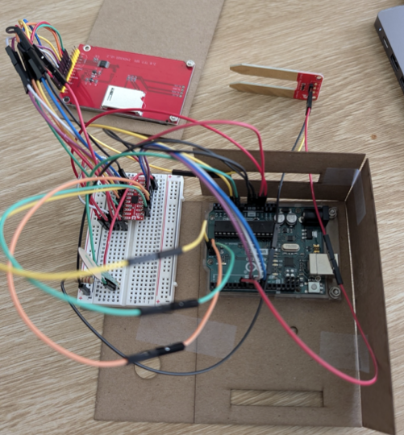

# Wildfire Sentinel - Prototype project for a cheap IoT wildfire monitor

---



---

## Overview

Wildfires are increasingly frequent and destructive, yet remote high-risk areas often lack any environmental monitoring infrastructure. Wildfire Sentinel is a cheap, sacrificial sensor node meant to be left in the field indefinitely. It continuously logs environmental conditions and transmits data over long-range wireless, building a picture of the environment leading up to, and during, a fire event.

The device is designed to be lost. If a fire reaches it, the data has already been sent.

This repository contains the prototype firmware and hardware documentation for a class project build. The current prototype demonstrates dual-sensor data capture and real-time visualization on a TFT display. Full sensor integration and wireless transmission are planned next steps.

---

## Prototype Demo

<!--  -->

The current prototype displays:
- **Soil moisture** — live reading with color-coded status (green = OK, red = dry) and a scrolling plot
- **Pressure sensor** — analog reading plotted in yellow (stand-in for additional environmental input)

A scrolling graph updates at ~20 Hz, with horizontal threshold lines marking wet/dry boundaries.

---

## Hardware

### Target Sensor Configuration

This is the intended full build. Some components are not yet integrated into the prototype.

| Component | Purpose | Est. Cost |
|---|---|---|
| Arduino Uno Rev. 3 | $20 |
| DHT22 or SHT31 | Temperature + humidity | $4–$8 |
| Plantower PMS5003 | PM2.5 / PM10 particulate (smoke) | $15–$20 |
| Capacitive Soil Moisture Sensor v1.2 | Soil dryness | $2-$4 |
| ILI9341 TFT Display (320×240) | Local data readout | $8–$12 |
| RFM95W LoRa Module (915 MHz) | Long-range wireless transmission | $8–$12 |
| Wire antenna / dipole | Extends LoRa range | $1–$3 |
| 18650 Li-ion Battery | Field power | $5–$8 |
| TP4056 Charge/Protection Module | Battery management | $1–$2 |
| Small Solar Panel (5V ~1W) | Trickle charging | $5–$10 |
| Weatherproof project enclosure | Field hardening | $5–$10 |
| Breadboard / PCB + jumper wires | Connections | $12 |
| **Total (approx.)** | | **~$77–$107** |

### Prototype Build (Current)

The working prototype uses the following:

| Component | Pin |
|---|---|
| ILI9341 TFT Display | CS→10, DC→8, RST→9 (SPI) |
| Soil Moisture Sensor | Signal→A1, Power→D7 |
| Pressure Sensor (stand-in) | A0 |

> **Note:** The soil sensor is pulsed via D7 rather than running continuously — this reduces corrosion on the sensor probes during long deployments.

---

## Wiring Diagram


---

## Firmware

### Requirements

- [Arduino IDE](https://www.arduino.cc/en/software) — version 2.3.7
- Libraries (install via Library Manager):
  - `Adafruit GFX Library`
  - `Adafruit ILI9341`
  - `SPI` (built-in)

### Configuration

At the top of `wildfire_sentinel.ino` you can adjust:

```cpp
int thresholdUp   = 400;  // Above this = wet (green)
int thresholdDown = 250;  // Below this = dry (red)
```

These values are raw ADC counts (0–1023) and will vary depending on your specific soil sensor. Calibrate by reading the sensor in dry soil and fully saturated soil.

---

## How It Works

1. The Arduino polls both sensors on every loop iteration (~20 Hz)
2. Soil moisture sensor is briefly powered via D7, read, then powered off to reduce electrolytic corrosion
3. Readings are mapped to Y positions on a 320×200 pixel scrolling graph
4. A status bar at the top shows live numeric values and a text status for soil moisture
5. When the plot reaches the right edge of the display, the graph clears and restarts from the left

The pressure sensor channel (A0) serves as a placeholder — in the full build this slot would be occupied by the PMS5003 particulate sensor or temperature sensor output.

---

## Project Status

| Feature | Status |
|---|---|
| TFT display + scrolling graph | ✅ Working |
| Soil moisture sensor | ✅ Working |
| Pressure sensor (stand-in) | ✅ Working |
| Temperature / humidity (DHT22) | 🔲 Not yet integrated |
| PM2.5 particulate (PMS5003) | 🔲 Not yet integrated |
| LoRa wireless transmission | 🔲 Not yet integrated |
| Solar + battery power system | 🔲 Not yet integrated |
| Weatherproof enclosure | 🔲 Not yet integrated |

---

## Next Steps

- Swap pressure sensor stand-in for real PM2.5 and temperature sensors
- Integrate RFM95W LoRa module and write transmission logic
- Build a simple remote dashboard or data logger to receive transmissions
- Design a weatherproof enclosure suitable for outdoor deployment
- Field test in a controlled environment

---

## License

This project is licensed under the [MIT License](LICENSE).
